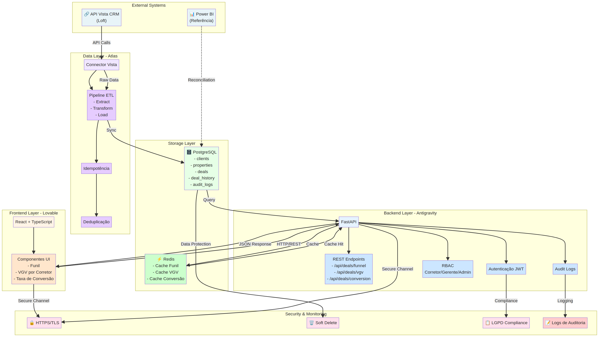
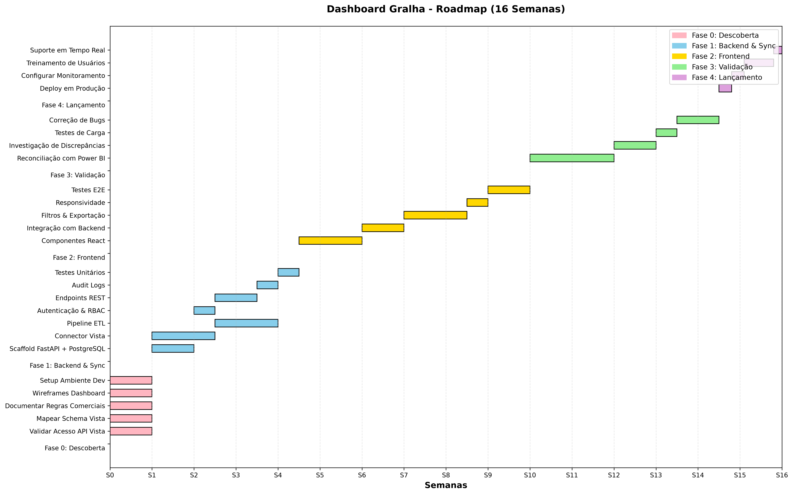
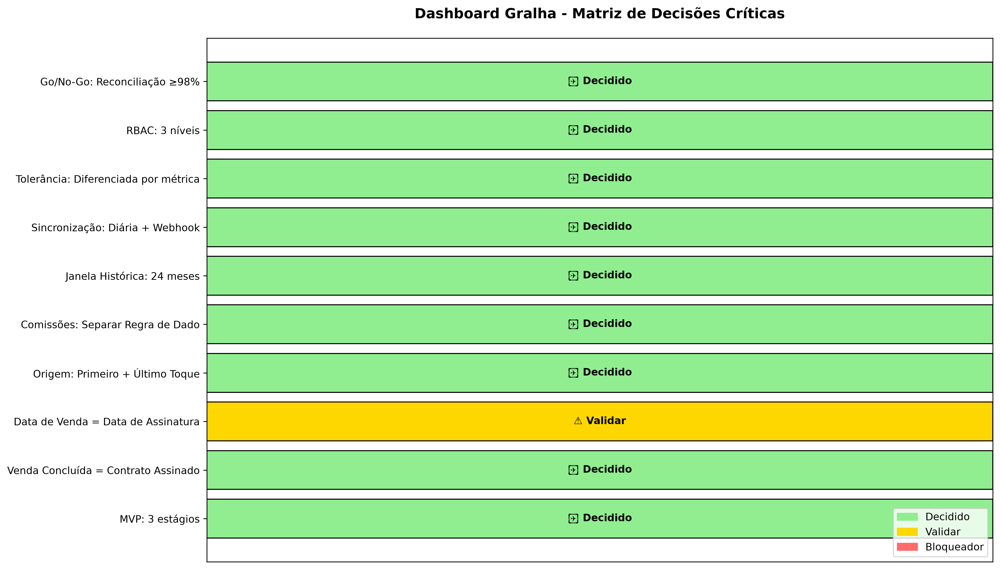

# Dashboard Gralha: Resumo Executivo & Próximos Passos

**Preparado por:** Manus AI  
**Data:** Agosto 2026  
**Destinatário:** Manduca, Antigravity, Lovable, Atlas  
**Status:** Pronto para Implementação

---

## 📋 Visão Geral da Orientação

A pesquisa paralela e análise executiva do projeto Dashboard Gralha produziram uma orientação abrangente baseada em **evidências verificáveis** de fontes primárias (API Vista CRM, padrões de indústria, documentação técnica) e **decisões estruturadas** para mitigar riscos de dados e implementação.

**Documentos Entregues:**
1. ✅ **Orientação Executiva Completa** (14 seções, 50+ páginas)
2. ✅ **Diagrama de Arquitetura** (React + FastAPI + PostgreSQL + Redis)
3. ✅ **Roadmap Gantt** (16 semanas, 5 fases)
4. ✅ **Matriz de Decisões Críticas** (10 decisões, status validado)
5. ✅ **Contrato de Métricas** (8 métricas, tolerâncias, regras de reprocessamento)
6. ✅ **Plano de Descoberta da API** (7 testes reproduzíveis)
7. ✅ **Backlog Priorizado** (P0/P1/P2 por frente)

---

## 🎯 Decisões Recomendadas (10 Pontos)

| # | Decisão | Status | Risco Mitigado |
|---|---------|--------|----------------|
| 1 | MVP: Funil de 3 estágios (Leads → Oportunidades → Vendas) | ✅ Decidido | Escopo descontrolado |
| 2 | Venda Concluída = Status "Contrato Assinado" + Data de Assinatura | ⚠️ Validar | Campo ausente em Vista |
| 3 | Data de Venda = Data de Assinatura do Contrato | ⚠️ Validar | Confusão com data de registro |
| 4 | Origem: Rastreamento de Primeiro + Último Toque (sem multi-toque MVP) | ✅ Decidido | Jornada incompleta |
| 5 | Comissões: Regra comercial separada de dado operacional | ✅ Decidido | Mistura lógica de negócio |
| 6 | Janela Histórica: 24 meses (jan/2025–ago/2026) + incrementais diários | ✅ Decidido | Dados incompletos |
| 7 | Sincronização: Diária (noturna) + webhook em tempo real para críticos | ✅ Decidido | Falhas de sincronização |
| 8 | Tolerância de Reconciliação: 0% vendas/VGV; ±2% leads; ±5% comissões | ✅ Decidido | Reprocessamento frequente |
| 9 | Segurança MVP: RBAC, soft delete, logs de auditoria, HTTPS | ✅ Decidido | Dados expostos |
| 10 | Go/No-Go: Reconciliação ≥98% em 3 métricas-chave; 0 erros críticos | ✅ Decidido | Lançamento prematuro |

---

## 🔍 Achados Críticos da Pesquisa Paralela

### ✅ Validado (Evidência Confirmada)

- **API Vista CRM existe e está documentada:** Documentação oficial em https://novovista-rest.vistahost.com.br/doc/ com endpoints para Clientes, Imóveis, Negócios, Histórico
- **Modelo Cliente–Imóvel–Histórico é padrão:** Confirmado em padrões de indústria e documentação técnica
- **Arquitetura React + FastAPI + PostgreSQL + Redis é robusta:** Validada por múltiplas fontes e tutoriais
- **Idempotência e deduplicação são essenciais:** Confirmado como prática fundamental em ETL
- **RBAC e soft delete são conformes a LGPD:** Validado em documentação de conformidade

### ⚠️ Validar em Fase 0 (Hipótese Não Confirmada)

- **Campo "Venda Concluída" em Vista:** Não confirmado; requer teste via `/negocios/listarcampos`
- **Campo "Data de Venda" em Vista:** Não confirmado; requer mapeamento de campos de data
- **Origem/Mídia de Captação em Vista:** Não confirmado; requer verificação de campos disponíveis
- **Cálculo de Comissões:** Regras comerciais da Gralha não documentadas; requer entrevista com Manduca
- **Rate Limits da API Vista:** Não documentado; requer teste empírico

### ❌ Bloqueador (Acesso Necessário)

- **Repositório MarcelManduca/crm-vista-BI:** Não é público; acesso necessário para validar estrutura, documentação e código existente

---

## 📊 Visualizações Geradas

### 1. Diagrama de Arquitetura

**Componentes:**
- **Frontend (Lovable):** React + TypeScript com componentes de Funil, VGV, Conversão
- **Backend (Antigravity):** FastAPI com autenticação JWT, RBAC, endpoints REST, logs de auditoria
- **Data Layer (Atlas):** Connector Vista, Pipeline ETL, idempotência, deduplicação
- **Storage:** PostgreSQL (persistência) + Redis (cache)
- **Segurança:** HTTPS/TLS, soft delete, conformidade LGPD

### 2. Roadmap Gantt (16 Semanas)

**Fases:**
- **Fase 0 (Semana 1–2):** Descoberta e validação (bloqueador: acesso API)
- **Fase 1 (Semana 3–6):** Backend e sincronização inicial
- **Fase 2 (Semana 7–10):** Frontend e visualizações
- **Fase 3 (Semana 11–13):** Validação e reconciliação com Power BI
- **Fase 4 (Semana 14–16):** Lançamento e monitoramento

### 3. Matriz de Decisões Críticas

**Status:**
- 🟢 **8 Decididas:** Funil, Venda, Data, Origem, Comissões, Histórico, Sincronização, Tolerância, RBAC, Go/No-Go
- 🟡 **2 Validar:** Data de Venda, Campos em Vista

---

## 🚀 Contrato de Métricas (Funil)

| Métrica | Definição | Tolerância | Fonte Canônica | Reprocessamento |
|---------|-----------|-----------|-----------------|-----------------|
| **Lead** | Cliente criado com contato | ±2% | API Vista `/clientes/listar` | Se duplicado: manter ID antigo |
| **Oportunidade** | Negócio em "Negociação" ou "Proposta" | ±2% | API Vista `/negocios/listar` | Se duplicado: manter ID antigo |
| **Venda** | Negócio "Contrato Assinado" + data | 0% | API Vista `/negocios/detalhes` | Se status mudou: incluir/remover |
| **VGV** | Soma de vendas | 0% | Cálculo (Vendas × Valor) | Se valor alterado: recalcular |
| **Taxa de Conversão** | (Vendas / Leads) × 100 | ±0.5pp | Cálculo derivado | Se Leads/Vendas mudarem |
| **Ciclo de Venda** | Dias Lead → Venda | ±1 dia | Cálculo (data_assinatura - data_criacao) | Se datas mudarem |
| **Comissão** | % sobre valor de negócio | ±5% | Tabela Gralha + API Vista | Se tabela/valor mudar |
| **Origem** | Primeiro/Último toque | ±10% | API Vista + Histórico | Se origem não preenchida: "Direto" |

---

## 📋 Plano de Descoberta (Fase 0 - Semana 1–2)

**Testes Reproduzíveis para Atlas:**

1. **Autenticação:** Confirmar credenciais e acesso à API Vista
2. **Schema Clientes:** Mapear campos via `/clientes/listarcampos`
3. **Schema Negócios:** Mapear campos via `/negocios/listarcampos` (crítico: confirmar "Contrato Assinado" e "data_assinatura")
4. **Negócios Fechados:** Filtrar por status "Contrato Assinado"
5. **Histórico:** Confirmar disponibilidade via `/historico/listar`
6. **Rate Limits:** Testar empiricamente (100 requisições/min)
7. **Origem/Mídia:** Confirmar campo em `/clientes/detalhes` ou `/negocios/listar`

**Saída Esperada:** Documentação de schema, endpoints testados, bloqueadores identificados

---

## 🎯 Backlog Priorizado (MVP)

### Antigravity (Backend) - P0
- Scaffold FastAPI + PostgreSQL + Redis
- Autenticação JWT + RBAC
- Tabelas (clients, properties, deals, deal_history, audit_logs)
- Endpoints REST (funil, VGV, conversão)
- Logs de auditoria
- Testes unitários (≥80%)

### Lovable (Frontend) - P0
- Componentes React (Funil, VGV, Conversão)
- Filtros (período, corretor, tipo de imóvel)
- Exportação (CSV/JSON)
- Login/Logout
- Responsividade
- Testes E2E (≥70%)

### Atlas (Sincronização/Dados) - P0
- Connector Vista (autenticação, paginação)
- Pipeline ETL (Extract, Transform, Load)
- Idempotência (chaves únicas)
- Deduplicação (soft delete)
- Tratamento de falhas (retry, logging)
- Checkpoints (recuperação)

---

## ⚠️ Riscos Críticos & Contingências

| Risco | Probabilidade | Impacto | Mitigação | Plano B |
|-------|--------------|--------|-----------|---------|
| API Vista indisponível | Média | Alto | Monitoramento 24/7; SLA com Loft | Cache local; sincronização offline |
| Campo "Venda Concluída" não existe | Baixa | Alto | Teste em Fase 0 | Usar status alternativo; lógica customizada |
| Falha de sincronização | Média | Alto | Idempotência; checkpoints; alertas | Reprocessamento manual; rollback |
| Reconciliação falha (>5% discrepância) | Média | Alto | Testes em Fase 3 | Atrasar lançamento; revisar lógica |
| Repositório privado sem acesso | Alta | Médio | Contato com Manduca em Fase 0 | Usar documentação alternativa; novo repo |

---

## ✅ Critérios de Go/No-Go para Lançamento

**Todos os critérios devem ser atendidos para lançamento:**

- ✅ Reconciliação de Leads: ±2%
- ✅ Reconciliação de Vendas: 0%
- ✅ Reconciliação de VGV: 0%
- ✅ Erros Críticos em Testes: 0
- ✅ Performance Funil: <1s
- ✅ Performance Exportação: <5s
- ✅ Disponibilidade em Carga: ≥99.5%
- ✅ Cobertura de Testes: ≥80%
- ✅ Adoção de Usuários: ≥70%
- ✅ Incidentes Críticos em 1 Semana: 0

**Decisão:** Go se todos atendidos; No-Go se qualquer critério falhar → Atrasar lançamento até correção

---

## 📞 Perguntas Críticas para Manduca (Antes de Fase 1)

1. **Repositório GitHub:** `MarcelManduca/crm-vista-BI` é privado? Como fornecer acesso?
2. **Regras de Comissão:** Qual é a tabela (6% urbano, 50/50 split, etc.)? Existem descontos/bônus?
3. **Período de Análise:** Qual período para reconciliação inicial? (jan–ago 2026?)
4. **Dados de Referência:** Quantos Leads, Oportunidades e Vendas esperados para ago/2026?
5. **Acesso à API Vista:** Quais são as credenciais de teste? (chave, tenant, rate limits)
6. **Campos Críticos:** Confirmar nomes exatos em Vista: "Venda Concluída", "Data de Venda", "Origem"
7. **Integrações Futuras:** Prioridades pós-MVP? (Alertas, Power BI, Análise Preditiva)
8. **Usuários:** Quantos corretores, gerentes, admins?
9. **SLA:** Disponibilidade esperada? (<1s latência?)
10. **Conformidade:** Requisitos específicos de LGPD ou segurança?

---

## 📚 Fontes Consultadas

| Fonte | Tipo | Confiabilidade |
|-------|------|----------------|
| API Vista CRM (Loft) - https://novovista-rest.vistahost.com.br/doc/ | Documentação Oficial | ✅ Alta |
| Red-Gate: Real Estate Data Model | Artigo Técnico | ✅ Alta |
| Salesforce: Real Estate CRM | Documentação de Produto | ✅ Alta |
| FastAPI: Documentação Oficial | Documentação Oficial | ✅ Alta |
| ETL Best Practices (Dev.to, Fivetran, Dagster) | Artigos Técnicos | ✅ Média-Alta |
| LGPD Compliance (BigID, Fortra) | Documentação de Conformidade | ✅ Alta |
| Padrões de Indústria Imobiliária (Use Mix, Supremo CRM) | Artigos de Indústria | ✅ Média |

---

## 🔗 Limitações da Análise

1. **Repositório Privado:** Não foi possível validar estrutura e código existente
2. **API Vista Não Testada:** Recomendações baseadas em documentação; testes práticos necessários
3. **Regras Comerciais:** Cálculo de comissões não confirmado; requer entrevista
4. **Dados Históricos:** Qualidade/completude não validada; testes em Fase 0 necessários
5. **Capacidade da Equipe:** Roadmap assume capacidade média; ajustes conforme confirmação real
6. **Integração Power BI:** Reconciliação em Fase 3; possíveis discrepâncias não previstas

---

## 🎬 Próximos Passos Imediatos (Semana 1)

### Para Manduca:
- [ ] Confirmar acesso ao repositório `MarcelManduca/crm-vista-BI` ou fornecer alternativa
- [ ] Fornecer credenciais de teste para API Vista (chave, tenant)
- [ ] Documentar regras de comissão (tabelas, splits, descontos)
- [ ] Confirmar período de análise para reconciliação
- [ ] Responder às 10 perguntas críticas (seção anterior)

### Para Atlas:
- [ ] Executar 7 testes de descoberta (Seção 7 do documento completo)
- [ ] Documentar schema de Clientes, Imóveis, Negócios
- [ ] Confirmar campos de "Venda Concluída", "Data de Venda", "Origem"
- [ ] Testar rate limits da API Vista
- [ ] Mapear endpoints e validar paginação

### Para Antigravity:
- [ ] Definir convenções de código (naming, estrutura de pastas)
- [ ] Iniciar scaffold FastAPI + PostgreSQL + Redis + Docker Compose
- [ ] Configurar CI/CD (GitHub Actions ou equivalente)
- [ ] Revisar arquitetura com equipe

### Para Lovable:
- [ ] Apresentar wireframes do dashboard para aprovação
- [ ] Definir design system (cores, tipografia, componentes)
- [ ] Revisar requisitos de responsividade

### Para Todos:
- [ ] Agendar kick-off da Fase 1 (semana 3) após conclusão de Fase 0
- [ ] Revisar e aprovar orientação executiva
- [ ] Confirmar capacidade e timeline

---

## 📄 Documentos Anexados

1. **dashboard_gralha_orientacao_executiva.md** (50+ páginas)
   - 14 seções completas
   - Decisões críticas, roadmap, contrato de métricas, riscos, backlog

2. **dashboard_gralha_arquitetura.png** (Diagrama Mermaid)
   - Arquitetura técnica completa
   - Componentes, fluxos de dados, segurança

3. **dashboard_gralha_roadmap_gantt.png** (Gráfico Gantt)
   - 16 semanas, 5 fases
   - Dependências e timeline

4. **dashboard_gralha_decisoes_matriz.png** (Matriz de Decisões)
   - 10 decisões críticas
   - Status (Decidido/Validar/Bloqueador)

5. **dashboard_gralha_wide_research.json** (Pesquisa Paralela)
   - 12 frentes de pesquisa
   - Achados, URLs, hipóteses, gaps

---

## 🎯 Conclusão

A orientação executiva do Dashboard Gralha fornece uma **base sólida e verificável** para implementação, com decisões estruturadas, riscos identificados e plano de ação claro. O MVP é **viável em 16 semanas** com foco em 3 estágios do funil, reconciliação rigorosa (0% para vendas/VGV) e conformidade LGPD.

**Status:** ✅ Pronto para Implementação  
**Próximo Passo:** Fase 0 (Semana 1–2) - Descoberta e Validação

---

**Preparado por:** Manus AI  
**Data:** Agosto 2026  
**Versão:** 1.0  
**Aprovação Necessária:** Manduca, Antigravity, Lovable, Atlas
